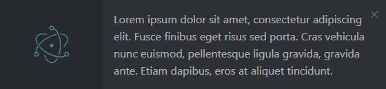
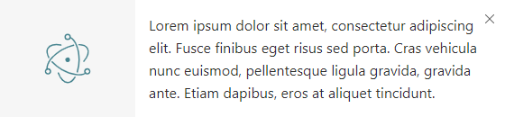

# electron-notification
A cross platform notification plugin for electron  
It uses BrowserWindows for the notifications, it also resizes the height of the window dynamically depending of the content size  
The notifications requires the electron screen api which cannot be run before [app.ready](https://electronjs.org/docs/api/app#event-ready)

## TODO
* Write a better README

## Changelogs

#### 1.0.1
* Added ability to use sounds
* Added icon position left or right
* Max notifications can now be set, a queue system has been implemented aswell
* Custom styles are now available in the options variable either base, dark or light can be changed.

## Installation
Install with npm:
```
npm install --save @wuild/electron-notification
```

```javascript
const Notification = require("@wuild/electron-notification");
```

#### Themes




#### Options
Name | type | default | description | alternatives
---:| --- | ---| ---| ---
title | String | -- | Notification title
body | String | -- | Notification body (can be html)
position | String | top-right | Notification position | top-left, top-right, bottom-left, bottom-right
theme | String | light | Notification theme | light, dark
width | Integer | 560 | Notification width
icon | String | default icon | Notification icon
iconPosition | String | left| Notification icon position | left, right
timeout | Integer | -- | Close notification after milliseconds
bottom | Integer | 15 | Margin between notifications,
sound | String | -- | Absolute path to audio file,
style.base | Object | -- | Default notification base style
style.dark | Object | -- | Dark notification style
style.light | Object | -- | Light notification style

#### Events
Name |  description
---:| ---
show | When the notification is shown
close | When the notification is closed
click | When the notification is clicked
dblclick | When the notification is double clicked
resize | When the notification is resized

#### Methods
Name |  description
---:| ---
show | Create and open the notification
close | Close the notification
closeAll | (Static) Close all open notification
setMaxNotifications | (Static) Set max amount of notifications visible

#### Example
```javascript
const {app} = require("electron");
const Notification = require("@wuild/electron-notification");

// Set max amount of notifications visible
Notification.setMaxNotifications(5);

app.on("ready", function () {
    let note = new Notification({
        theme: "light",
        title: "This is a notification",
        sound: "absolute path to audio file",
        body: "Lorem ipsum dolor sit amet, consectetur adipiscing elit. Fusce finibus eget risus sed porta. Cras vehicula nunc euismod, pellentesque ligula gravida, gravida ante. Etiam dapibus, eros at aliquet tincidunt."
    });
    
    note.on("close", function(){
       console.log("Notification has been closed"); 
    });
    
    note.show();
    
    let note2 = new Notification({
        theme: "dark",
        title: "This is a notification",
        body: "Lorem ipsum dolor sit amet, consectetur adipiscing elit. Fusce finibus eget risus sed porta. Cras vehicula nunc euismod, pellentesque ligula gravida, gravida ante. Etiam dapibus, eros at aliquet tincidunt."
    });
    
    note2.on("click", function(){
       console.log("Notification has been clicked"); 
    });
    
    note2.on("dblclick", function(){
        console.log("Notification has been doubled clicked"); 
    });
    
    note2.show();
});
```

#### Default style object
```javascript
{
  base: {
    body: {
      display: "flex",
      flexDirection: "row",
      flex: 1,
      minHeight: "1px",
      height: "100%"
    },
    close: {
      position: "absolute",
      zIndex: 10,
      right: "5px",
      top: 0,
      padding: "7px"
    },
    sidebar: {
      display: "flex",
      width: "150px",
      alignItems: "center",
      justifyContent: "center",
      flexShrink: 0,
      flexGrow: 0,
      padding: "17px"
    },
    container: {
      flex: 1,
      minHeight: "1px",
      padding: "15px"
    },
    title: {
      padding: 0,
      margin: 0
    },
    content: {
      overflow: "visible"
    }
  },
  dark: {
    sidebar: {
      backgroundColor: "#262a2e"
    },
    container: {
      backgroundColor: "#2d3135",
      color: "hsla(0, 0%, 100%, .6)"
    },
    close: {
      color: "hsla(0, 0%, 100%, .6)"
    }
  },
  light: {
    sidebar: {
      backgroundColor: "#f6f6f6"
    },
    container: {
      backgroundColor: "#fff",
      color: "#2c2c2c"
    },
    close: {
      color: "#000"
    }
  }
}
```

#### License
Copyright © 2018, [Wuild](https://github.com/Wuild) Released under the [MIT license](https://opensource.org/licenses/MIT).